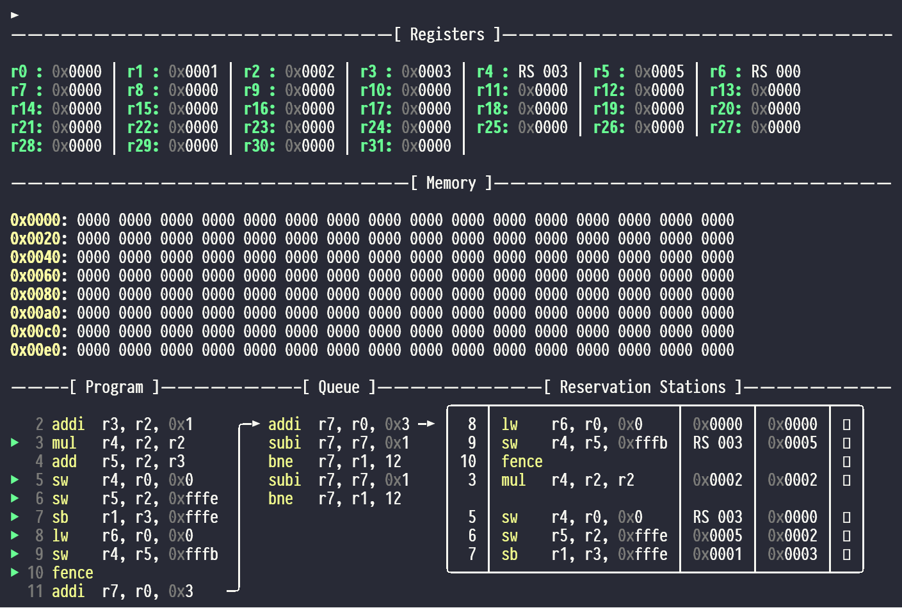
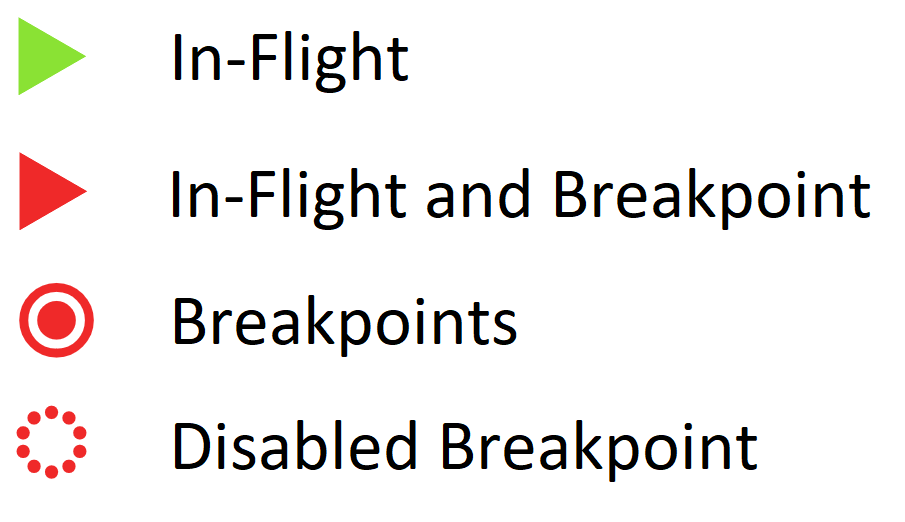

# User Interface and Usage {#sec:UI}

This chapter focuses on the usage of the application. The user interface and the design choices are described. An instruction on how to prepare the system and how to run the program is given. Furthermore, the application and it's features are explained in detail. Finally, we showcase the application in action.

## Purpose and Inspiration

In order to demonstrate Meltdown and Spectre attacks, this program is designed to visualize the execution of a modern CPU on a microarchitectural level. We implement a simplified model of a CPU to keep focus on the essential parts to understand the demonstrated attacks. At the same time, the CPU needs to show all information required to follow the attack, and offer convenient features to the user.

The emulator follows the rough structure of the GNU Debugger GNU [@GDB] and more specifically the extension Pwndbg [@pwndbg]. The assumption is that many members of the target audience are already well familiar with the GNU Debugger and the Pwndbg extension. GDB and Pwndbg can be interacted with via the command line. Different to other similar solutions, GDB can only be interacted with using commands. Most notable is the 'context' screen, which is issued after execution is paused. The context screen prints out the current state of the CPU, including the registers, the stack, a backtrace, and the disassembly.

As with GDB, the emulator can only be interacted with using commands. We further implement auto-completion and auto-suggestion using the \texttt{python-prompt-toolkit} [@prompt]. This should lower the difficulty of getting started with a new tool. The emulator also implements a Pwndbg-style context-visualization, albeit with different elements shown to adapt to the different goal compared to GDB. This ensures most of the relevant information is on the screen at all times.

## System Requirements and installation

The following things need to be installed to run the program:

- Python
- Python-Benedict
- Python-Prompt-Toolkit

To install the required packages, one may use the following command:\footnote{The requirements file is located in the root directory of the project. In some distributions pip may be called pip3.}

    pip install -r requirements.txt

Optionally, the following things can be installed to allow for git fingerprints in the log output:

- Git

It is recommended to use the program on a Linux system, although Windows functionality is mostly implemented. Further, it's recommended to have a terminal with a width of at least 120 characters.

TThe program is tested on the following system:

- Debian GNU/Linux 11 (bullseye) 
- Python 3.9.10
- Python-Prompt-Toolkit 3.0.28
- Python-Benedict 0.25.0
- Git Commit 419678d33a41eefb0bcd775966dae0418ba51245

## Running the program

The syntax for running the emulator from the root folder of the repository is:

    python -m src.shell <path_to_target_program>

If no target program is supplied, the emulator will print system information, along with a help message. The target program may contain instructions as specified in [@sec:ISA](#sec:ISA), separated by linebreaks. Comments can be added to the target program by preceding them with \texttt{//}. Furthermore, the \texttt{config.yml} file in the root folder can be modified to configure the emulator, see [@sec:config].

## The Context Screen {#sec:context_screen}

The core of the visualization is the context screen. Here most of the relevant information is shown. The context screen is printed out every time the execution is paused. Alternatively, pressing enter with an empty input will also print the context screen. [@fig:context] shows an example output of the context screen.

{#fig:context width=470px height=317px shortcaption='Example output of the context screen'}

The context screen is divided into three sections: first, the registers are being shown, as if the \texttt{show regs} command was issued (for details on the commands, refer to the following [@sec:commands]). The second section shows the Memory, also analogous to the \texttt{show mem} command. The third section shows the whole pipeline, itself being divided into visualization of the Program, the Instruction Queue and finally the Reservation Stations. By default only a part of the Program is printed - all in-flight instructions as well as one further instruction each before and after will be displayed. Further, arrows connect the different stages of the pipeline. These arrows show the location of the instruction that will be issued next into the Reservation Station in both the Program, as well as the Instruction Queue.

## Commands {#sec:commands}

Following, we describe the commands available in the emulator. The commands are grouped into the following categories: displaying information, modifying the CPU, commands that revolve around pausing and resuming the execution, breakpoint management, as well as some miscellaneous commands.

### Display Information

When displaying specific information, the following command serves as a base:

    show

The display commands were implemented side-effect free, looking at the internals of the execution without interfering is the core idea of the emulator. 

The following subcommands are available:

#### show mem

Show the memory of the CPU, visualized as words in hexadecimal.

    show mem <start in hex> <words in hex>

The first parameter is the start address of the memory to be shown, the second is the number of words to be shown. The parameters are optional, the emulator defaults to showing memory starting at address \texttt{0x0000} until 8 lines of the terminal are printed. Displaying contents from the memory does neither load the memory into the cache if not already present, nor does it change the order of future eviction from the cache. The subcommand is thus side effect free.

#### show cache

Show the cache. The visualization is configurable in the \texttt{config.yml} file, see [@sec:config].

    show cache

#### show regs

Show the CPU registers. For each register, either the value of the word is shown in hexadecimal, or, in case the register is waiting for the result of a reservation station, a reference to that reservation station is shown. The nomenclature is configurable in the \texttt{config.yml} file, see [@sec:config]. 

    show regs

#### show queue

Display all instructions currently in the instruction queue. The topmost instruction is the one being issued next, the bottommost is the instruction last loaded into the queue.

    show queue

#### show rs

Displays the reservation stations. Whether or not empty slots are shown is configurable in the \texttt{config.yml} file, see [@sec:config]. The information supplied includes the index of the instruction in the source code, the instruction itself, as well as current values for the source operands, either as a word in hexadecimal, or as a reference to another reservation station. This allows the user to quickly determine, which reservation stations are currently waiting for the result of other reservation stations, and are stalled as a result. Furthermore, retiring instructions are marked with a ticked checkbow. 

Should the user select to use a microcode in case a fault is encountered (see [@sec:config]), the instructions originating from the injected microcode will be marked with a $\mu$ symbol instead of the index of the instruction.

    show rs

#### show prog {#sec:showprog}

Displays a visualization of the source program. Further, there are icons indicating which instructions are currently in-flight, as well as which instruction is marked as a breakpoint. 

    show prog

{width=137px height=78px}\

#### show bpu

Displays the value of the 2bit counter for every index in the BPU.

    show bpu

### Modifying the CPU

When modifying the CPU, the following command serves as a base:

    edit

The following subcommands are available:

#### edit word

Takes an address and value in hexadecimal, and overwrites the word at that address with the new value.

    edit word <address in hex> <value in hex>

Editing the memory through this command does not affect which lines are stored in the cache. It does update the contents of the cache, however, if the address is in the cache, to keep the state of the cache and memory consistent. The user should be aware that the memory is addressed bytewise, but the subcommand is writing a word in little-endian order. 

#### edit byte

Takes and address and a value in hexadecimal, and overwrites the byte at that address with the new value.

    edit byte <address in hex> <value in hex>

This command is analogous to the \texttt{edit word} command, but operates on a byte instead of a word.

#### edit flush 

Allows to flush the cache, selectively or fully.

    edit flush <address in hex>

If no address is supplied, the entire cache is flushed. If an address is supplied, the cacheline containing that address is flushed, if present in the cache.

#### edit reg

Changes the value of a register.

    edit reg <register (0-31)> <value in hex>

Any of the 32 registers (\texttt{0-31}) can be modified.

#### edit bpu

Overwrites the 2bit counter for a specific index in the BPU.

    edit bpu <pc in dec> <value (0-3)>

The values correspond to the following:

- \texttt{0}: Strongly not taken
- \texttt{1}: Weakly not taken
- \texttt{2}: Weakly taken
- \texttt{3}: Strongly taken

See further in chapter \ref{sec:BPU} for more information.

### Breakpoint Management

Inspired by GDB and other debuggers, the emulator implements support for Breakpoints. Breakpoints are a mechanism to pause the execution of the emulator. They can be set for a specific instruction, upon issuing an instruction with an active breakpoint set, the execution will be paused, and control given to the user. The execution will thus be paused immediately after an instruction has been loaded into a reservation station slot.

The emulator allows to set, clear, toggle and list breakpoints. The base command is:

    break

#### break add

Sets a breakpoint for the instruction at the given index.

    break add <index in decimal>

#### break delete

Deletes the breakpoint for the instruction at the given index, if it exists.

    break delete <index in decimal>

#### break toggle

Disables an active breakpoints, and likewise enables a disabled breakpoint.

    break toggle <index in decimal>

#### break list

Outputs a list of all breakpoints, and whether they are enabled or disabled.

    break list

Note that the breakpoints also can be seen when calling \texttt{show prog}. See [@sec:showprog] for more information.

### Pause and Resume Execution

Since the emulator is thought to be used similar to a debugger, to provide a more convenient way to pause and resume execution, the following commands are available:

#### continue

Continues execution of the program.

    continue

The execution will be resumed until the next breakpoint is reached, a fault is encountered, or the program terminates.

#### step

Allows to step through the program one cycle at a time.

    step <steps>

If steps is not supplied, the emulator will execute a single cycle. If steps is supplied, the emulator will execute the specified number of cycles. The execution is also paused when encountering a breakpoint, a fault, or the program terminates.

If a negative number is supplied, the emulator will execute the specified number of cycles in reverse order. This allows the user to conveniently review the events that occur during the execution without having to restart the program. Furthermore, this can be combined with other commands such as \texttt{continue}, to see the status during the last cycle before a notable event, such as a fault, caused the execution to be paused.

#### retire 

Continues execution of the program until the next instruction is retired.

    retire

As with \texttt{step} and \texttt{continue}, the execution is also paused when encountering a breakpoint, a fault, or the program terminates.

#### Restart

Resets the program to the state it was in after launching the emulator.

    restart

### Miscellaneous Commands

Further, the following commands are available:

#### quit

Quits the program.

    quit

Also can be called using:

    q

#### help

Displays help.
    
        help

#### clear

Clears the screen

    clear
