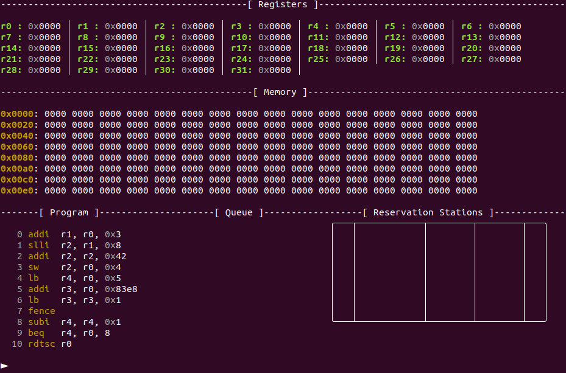
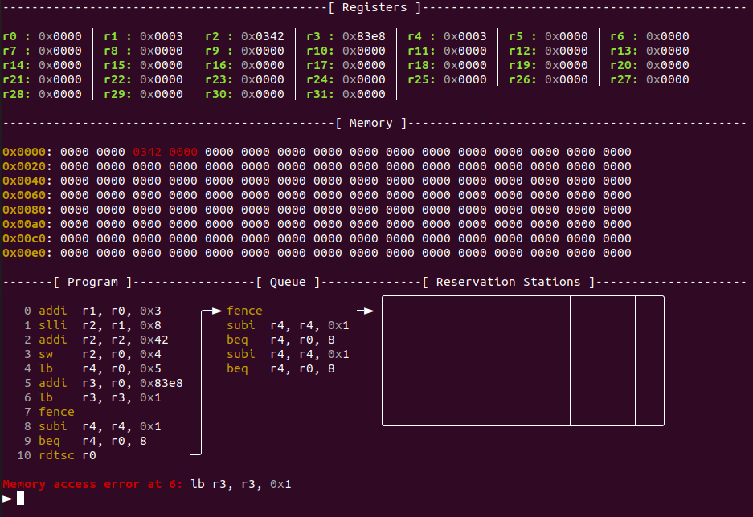
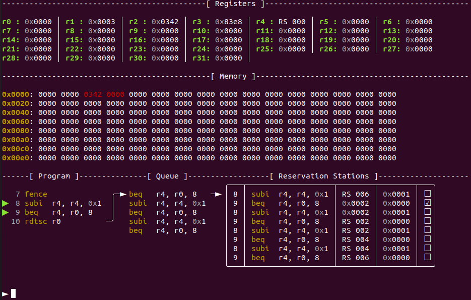
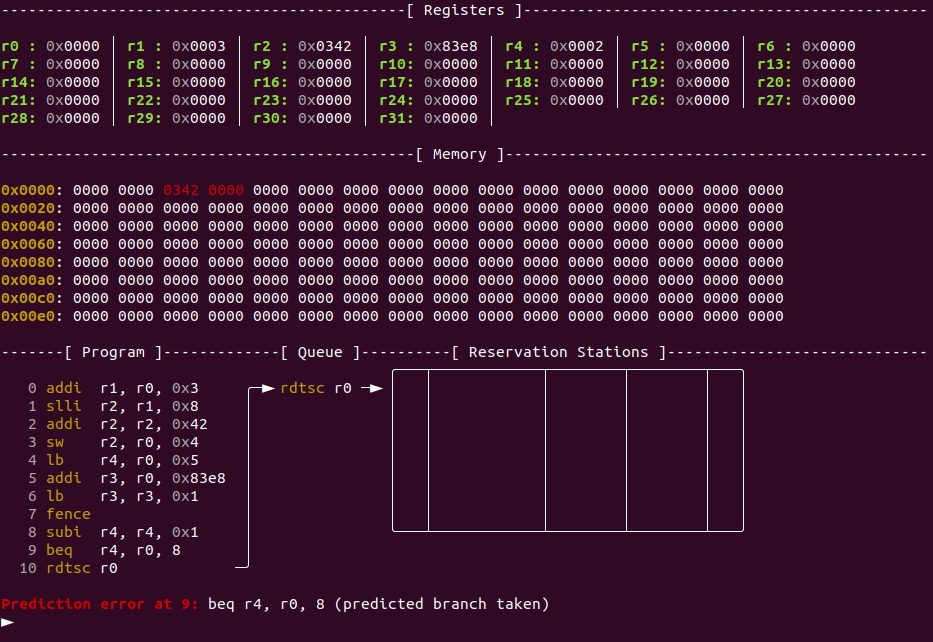
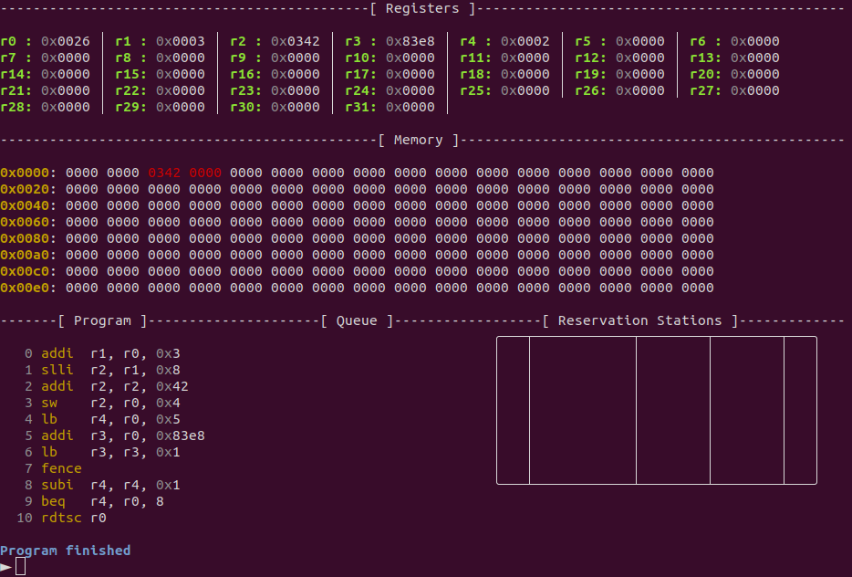
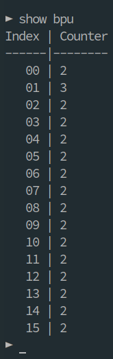
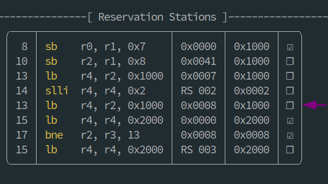

# Demonstration and Evaluation {#sec:evaluation}
\marginpar{Melina Hoffmann}

As specified in [chapter @sec:task], our goal is to implement a CPU emulator that offers out-of-order and speculative execution in order to demonstrate a Meltdown and a Spectre attack.
In this chapter we demonstrate that our emulator allows for the user to execute both a Meltdown and a Spectre attack, with the use of basic example programs. 
Firstly, we introduce the general functionality and visualization of our emulator with a simple example program that does not yet implement microarchitectural attacks in [@sec:evaluation_example].
Then, we demonstrate both the Meltdown and the Spectre variant which are possible on our emulator in [@sec:evaluation_meltdown] and [@sec:evaluation_spectre] respectively.
Lastly, we show different mitigations against these microarchitectural attacks on our emulator, which are based on mitigations against real life microarchitectural attacks, in [@sec:evaluation_mitigations].

## Example Program {#sec:evaluation_example}
\marginpar{Melina Hoffmann}

In this section, we introduce different components of the visualization of our emulator and showcase our emulators out-of-order and speculative execution.
To this end, we `step` through an example program and introduce the central components of our vizualisation. 
Introducing all the commands and visualizations our emulator implements with an example program would be out of scope of this section, but a complete list of commands is given in [chapter @sec:UI].

This is our example program.
it is included as `demo.tea`in our gitlab repository.
To produce the examples for this section, the program is run on the default config settings as discussed in [@sec:config].

    addi r1, r0, 3
    slli r2, r1, 8
    addi r2, r2, 66
    sw r2, r0, 4
    lb r4, r0, 5
    addi r3, r0, 33768
    lb r3, r3, 1
    fence
    loop_label:
        subi r4, r4, 1
        beq r4, r0, loop_label
    rdtsc r0

When we start the emulator, it automatically loads the program and shows the first context screen, as described in [@sec:context_screen].
As we see in [@fig:ep_01_start], the registers and the shown memory section are initialised to zero and the instruction queue and reservation station are still empty.

{#fig:ep_01_start width=470px height=317px shortcaption='Context screen at the start of the program'}


As we can see in [@fig:ep_02_two_steps], within the first two `steps` the instruction queue is filled with the first five instructions, which are subsequently issued into the reservation station as per Tomasulo's algorithm for out-of-order execution as discussed in [@sec:Tomasulo].
Instruction 0 is immediately executed, since it is in the first slot of the reservation station and all of it operands are ready as soon as it is issued.
By the checkmark in the rightmost column in the reservation station, we can see that it is ready to retire.
Since its result is broadcasted directly after the instruction finishes executing, register 1 and the first operand of instruction 1 are already set to 0x003.

As per Tomasulo's algorithm, in [@fig:ep_02_two_steps] we see `SlotIDs` as placeholders for the result of the instruction in the respective reservation station slot, both in the registers and the operand lists of instructions in the reservation station. 
For example, register 2 is waiting for the result produced by the `addi` instruction in slot 2 of the reservation station and contains the placeholder `RS 002`.
Note in particular, that for the `slli` instruction with `SlotID` 1 we see that its target register 2 already contains the `SlotID` of the next instruction. 
But in the operand list of the `addi` in slot 2 the reservation station we can see the `SlotID` of the `slli` instruction waiting to be replaced with the result value.

{#fig:ep_02_two_steps width=470px height=317px shortcaption='Context screen after two `steps`'}

In the next step, the fence instruction is issued into the reservation station.
Therefore no more instructions are issued into the reservation station until all currently issued instructions have been executed.
This can be observed in [@fig:ep_05_addi_ooe_full] and [@fig:ep_08_legal_load_result], in which the empty slots in the reservation station are not refilled with the instructions waiting in the instruction queue.

After the `slli` and the `addi` instructions in slots 1 and 2 of the reservation station, the program contains two memory operations `sw` and `lb`.
Since memory instructions take longer to execute, the `addi` instruction in slot 5 of the reservation station is executed out-of-order before the memory instructions retire.
[@fig:ep_05_addi_ooe_full] shows the reservation station that still contains the `sw` and `lb` instructions but from which the `addi` instruction has already retired.

{#fig:ep_05_addi_ooe_full width=470px height=317px shortcaption='Context screen after out-of-order execution of the `addi` instruction in slot 5'}

During the execution of the `sw` instruction, the value 0x0342 is stored as a `Word` starting at memory address 4. 
In our example this is highlighted further by the the memory addresses 4-7 changing their color to red.
This signifies that they are placed in the cache as a `cacheline` of length four bytes.
Since we cannot visualize the whole memory all at once, we also offer a more detailed  visualization of the whole cache, as depicted in [@fig:ep_07_cache].
The result of the store instruction is placed into memory multiple cycles before the instruction retires, both to model real world latencies in memory accesses and to leave enough time to check for faults during which transient execution happens, as we see in [@sec:evaluation_meltdown].
Therefore, we can already observe the aforementioned changes in the memory visualization in [@fig:ep_05_addi_ooe_full], while the `sw` instruction is still being executed and present in the reservation station.

{#fig:ep_07_cache shortcaption='Cached target address of the `sw` instruction'}

The `lb` instruction in slot 4 only reads one byte from memory address 5.
Since the `sw` instruction places its `Word` value into memory in little endian order, the result of reading one byte from memory address 5 is 0x03.
This can be observed as the new value of register 4 in [@fig:ep_08_legal_load_result], where the `lb` instruction has finished executing and is ready to retire, as shown by the tickmark.

{#fig:ep_08_legal_load_result width=470px height=317px shortcaption='Context screen  with the `lb` instruction in slot 4 ready to retire'}

With the `lb` instruction in slot 6 of the reservation station, we attempt to load a value from the inaccessible part of the memory, as described in [@sec:memory].
During the execution, the value 0x42 from the inaccessible address is present in the target register 3, as we can observe in [@fig:ep_08_legal_load_result].
But before the instruction can retire, the fault is detected and the target register is rolled back to its previous state.
Due to the rollback the reservation station is cleared and the subsequent instructions are put back into the instruction queue [@sec:rollback].
In [@fig:ep_09_mem_fault] we can see the previous value of 0x83e8 from the address calculation in register 3, and the rolled back instruction queue and reservation station as well as the fault message.

{#fig:ep_09_mem_fault width=470px height=317px shortcaption='Rolled back memory fault'}

Now the `fence` instruction can be executed and the subsequent instructions are put into the instruction queue and issued to the reservation station.
Since per the default settings all branches are initially predicted as taken, we speculatively fill the instruction queue and reservation station with as many iterations of the loop as fit into them, as seen in [@fig:ep_10_loop_full].
Since the branch condition is already violated in the first iteration of the loop and the branch is not taken, we have a misprediction that results in a fault message and a rollback. 
During the rollback the reservation station is cleared of the excess instructions from the loop iterations that are not executed after all. 
Instead the `rtdsc` instruction, which follows the loop in the program, is put into the instruction queue, as we can see in [@fig:ep_12_loop_fault_full].

{#fig:ep_10_loop_full width=470px height=317px shortcaption='Loop instructions are speculatively put into the instruction queue and issued into the reservation station'}

{#fig:ep_12_loop_fault_full width=470px height=317px shortcaption='Rolled back loop fault'}

Lastly the `rdtsc` instruction is executed and shows in register 0 that the program took 0x0026 cycles to execute so far. 
The end of the program is marked by the end message as well as the empty instruction queue and reservation station, as we can see in [@fig:ep_14_end].

{#fig:ep_14_end width=470px height=317px shortcaption='Context screen at the end of the execution of the example program'}


## Demonstration of a Meltdown-Type Attack {#sec:evaluation_meltdown}

\marginpar{Jan-Niklas Sohn}

<!-- - demonstrate that a meltdown-type attack can be performed inside our emulator
- this is shown through an example program that performs such an attack
- afterwards the attack is categorized according to the naming scheme established by transient-fail
- and compared to the attack described in the original meltdown paper -->

This chapter demonstrates that a Meltdown-type attack can be performed inside our CPU emulator.
This is shown through an example program that performs such an attack. The example program and the inner workings of the attack are described in [@sec:evaluation_meltdown_attack].
In [@sec:evaluation_meltdown_cmp] the attack is categorized according to the naming scheme established by Canella et al. [@transient_fail] and compared to the attack described in the original Meltdown paper [@meltdown].

### A Meltdown-Type Attack {#sec:evaluation_meltdown_attack}

<!-- - high-level explanation
  - Load byte from inaccessible memory. That triggers a fault
  - During the following transient execution, use loaded value to index into a "probe array"
  - That causes this entry of the probe array to be cached, encodes the value in the cache
  - After the transient execution, check which entry of the probe array is cached
    - By loading each entry and measuring the access time
  - That way we leak the value that is supposed to be inaccessible -->

The Meltdown-type attack described in this section starts with loading a byte from inaccessible memory. This access causes a fault.
During the following transient execution, the value resulting from the faulting load is used to index into a previously prepared *probe array*.
This causes the accessed entry of the probe array to be cached. Thus, the value resulting from the faulting load is encoded into the cache.
After the transient execution has ended and the rollback has been performed, the attack checks which entry of the probe array is cached. This is achieved by loading each entry and measuring its access time.
In this way, the value retrieved by the faulting load is leaked, even though it is supposed to be inaccessible.

<!-- - code: meltdown part
- explanation meltdown part
  - Load byte from the inaccessible address 0xc000
  - Shift by 4, multiplying the value by 0x10, because the entries of our probe array are 0x10 bytes apart
  - Use resulting value to index into the probe array starting at address 0x1000
- when we step through the program, we see that the faulting load indeed provides the secret value 0x42 to the following instructions (screenshot)
- after the transient execution is ended by the rollback, we can investigate the state of the cache to see that entry 0x42 of the probe array is cached (screenshot) -->

The code in [@lst:our_meltdown] illustrates the core part of our attack. It loads a byte from the inaccessible memory address `0xc000`.
The resulting value is shifted to the left by 2 bits, multiplying the value by 4. This is done because the entries of our probe array are 4 bytes apart, which matches the default cache line size of our emulator.
The shifted value is then used to index into the probe array, which starts at address `0x1000`.
When stepping through the program until the faulting load instruction has executed and provided its result to subsequent instructions, as is shown in [@fig:meltdown1], we observe that the faulting load indeed provides the secret value `0x42` to the following `slli` instruction.
After the transient execution is terminated by the rollback, we use the `show cache` command to investigate the state of the cache. As [@fig:meltdown2] shows, we see that the entry at index `0x42` of the probe array is cached.
Thus, the secret value obtained during transient execution was successfully encoded into the cache.

```{float=tbp #lst:our_meltdown}
lb r1, r0, 0xc000
slli r1, r1, 2
lb r2, r1, 0x1000
```

: Core part of our Meltdown-type attack, loading a byte from an inaccessible address and encoding it into the cache.

{#fig:meltdown1}

{#fig:meltdown2}

<!-- - code: cache decoding
- explanation cache decoding
  - Loops over the probe array and records the shortest access time
  - During the loop, register r1 stores the index of the shortest seen access, and register r2 stores its access time. Register r3 stores the current index into the probe array, and register r4 stores the length of the probe array. To simplify the code, the indices and lengths are stored in units of bytes and not in units of probe array entries.
  - These registers are initialized in the block starting in line X
  - The loop body starting in line X performs an access into the probe array, and records the access time
  - This is done by surrounding the `lb` instruction that performs the access with `fence; rdtsc` sequences that record the cycle counter before and after the access
  - The fence in front of the lb ensures that the recorded cycle count closely matches the time the lb is issued, by waiting for preceding instructions occupying the reservation station to complete
  - The fence following the lb ensures that the load completes before the cycle count is recorded
  - The second part of the loop body, starting at line X, updates the shortest access index and time in the case that the load was the shortest yet
  - The loop tail starts at line X and increments the index into the probe array. It checks if the end of the probe array was reached, looping back up to line X if that is not the case.
- this cache decoding step does not work with the default cache configuration, since it is only able to store up to 4*4=16 entries; to store 256 cache entries, 64 sets and 4 ways are used
- when executing the whole program, we can see that index 0x42 had the shortest access time; the secret was transmitted from the transient execution successfully -->

The code in [@lst:our_meltdown_decode] displays the cache-decoding part of our attack. It loops over the probe array and records the shortest access time.
During the loop, register `r1` stores the index of the shortest seen access, and register `r2` stores its access time. Register `r3` stores the current index into the probe array, and register `r4` stores the length of the probe array. To simplify the code, the indices and lengths are stored in units of bytes and not in units of probe array entries.
These registers are initialized in the block starting in line 3.
The loop body starting in line 13 performs an access into the probe array, and records the access time.
This is done by surrounding the `lb` instruction that performs the access with `fence; rdtsc` sequences that record the cycle counter before and after the access.
The fence in front of the `lb` instruction ensures that the recorded cycle count closely matches the time the `lb` instruction is issued. It waits for preceding instructions to complete, so that the reservation station has enough free slots to issue the `lb` instruction immediately after issuing the `rdtsc` instruction.
The fence following the `lb` instruction ensures that the load completes before the second cycle count is recorded.
The second part of the loop body, starting at line 21, updates the shortest access index and time in the case that the load was the shortest yet.
The loop tail starts at line 27 and increments the index into the probe array. It checks if the end of the probe array was reached, looping back up to line 13 if that is not the case.

When we observe the register values after having executed the whole program, as is shown in [@fig:meltdown3], we can see that register `r1` contains the value `0x108`. This means that index `0x42` had the shortest access time; the secret was decoded from the cache successfully.
Since the default cache configuration established in [@sec:config-cache] uses 4 cache sets and 4 cache ways, iterating over the probe array might evict the cached entry before the short access time was seen.
Thus, for this attack we use 64 cache sets and 4 cache ways.

```{float=tb #lst:our_meltdown_decode}
// Loop over the probe array, record the shortest access time:

// Index of shortest access, in bytes
addi r1, r0, 0
// Time of shortest access
addi r2, r0, -1
// Current index, in bytes
addi r3, r0, 0
// Probe array length, in bytes
addi r4, r0, 0x400
probe:

// Perform timed access into probe array
fence
rdtsc r5
lb r7, r3, 0x1000
fence
rdtsc r6
sub r5, r6, r5

// Update shortest access
bgu r5, r2, skip
addi r1, r3, 0
addi r2, r5, 0
skip:

// Increment index and loop
addi r3, r3, 4
bne r3, r4, probe
```

: Cache-decoding part of our Meltdown-type attack, looping over the probe array and recording the shortest access time.

{#fig:meltdown3 width=555px height=84px}

<!-- - which components interact to make it work
  - out of order execution that leads to a transient execution window after the faulting load
  - memory subsystem that provides the value stored in memory as the result of the load, even when it faults
  - cache that is used as a transmission channel from the transient execution domain to the architectural domain -->

Several components of our CPU emulator interact to make this Meltdown-type attack possible.

- Out-of-order execution leads to a transient execution window after the faulting load.

- The memory subsystem provides the value stored in memory as the result of the load instruction, even though the instruction faults.

- The cache is used as a transmission channel from the transient execution domain to the architectural domain.

### Comparison With Meltdown-Type Attacks on Real CPUs {#sec:evaluation_meltdown_cmp}

<!-- - explain which Meltdown variant it implements: Meltdown-US-L1 and Meltdown-US-Mem
  - according to transient-fail naming scheme
    - first component describes how the leaking fault is triggered
    - second component describes where the leaked data comes from
  - our scheme for checking memory accesses models the way the user/supervisor-bit is usually set up in x86 operating systems, in that the top half of memory is reserved for the kernel and accesses to it cause a fault
  - if the value accessed by the meltdown snippet already resides in the cache, the value is leaked from the cache. this results in meltdown-us-l1. if the value is not cached, it is leaked from main memory. this results in meltdown-us-mem -->

Meltdown-type attacks are typically classified according to the naming scheme first introduced by Canella et al. [@transient_fail].
This scheme adds two name components to the "Meltdown-" stem. The first component describes the microarchitectural condition that causes the leaking fault. The second component describes the microarchitectural element that data is leaked from.
Our scheme for checking memory accesses models the way the US-bit is usually set up on x86 systems, where the top half of memory is reversed for the kernel and accesses to it cause a fault.
If the value accessed by our attack already resides in the cache, the value is leaked from the cache. This results in a variant similar to Meltdown-US-L1. If the value is not cached, it is leaked from main memory, which results in a variant similar to Meltdown-US-Mem.

<!-- - compare to example program from meltdown paper
  - code: the small meltdown snippet
  - explain how it works
    - loads a byte from a kernel address
    - shifts the value by 12, multiplying it by 0x1000
    - retries the load until it produces a non-zero value
    - uses the value to index into the probe array
  - point out differences
    - very similar to our code snippet
    - beside the differing size of the probe array entries, the only difference is the retry loop
    - on real x86 CPUs the faulting load only leaks data sporadically
    - our emulator is completely deterministic -> attack works every time -->

[Listing @lst:orig_meltdown] displays the core part of the original Meltdown attack, taken verbatim from the corresponding paper [@meltdown].
This code loads a byte from a kernel address, causing a fault. In the following transient execution, the value retrieved by the faulting load is shifted left by 12 bits, multiplying the value by 4096. If the resulting value is zero, the faulting load is executed again, until it produces a non-zero value. Finally, the shifted value is used to index into the probe array.
This core part of the attack is very similar to the core part of our Meltdown-type attack (described above and shown in [@lst:our_meltdown]).
Beside the differing size of the probe array entries, the only difference is the retry loop. On real x86 CPUs the faulting load only leaks data sporadically. Because of this, immediately performing the load again if the leak fails increases the attack's performance [@meltdown, sec. 5.2]. In contrast to this, our CPU emulator is completely deterministic; the core of our attack succeeds every time and no retry loop is necessary.

\begin{lstlisting}[caption={Core of the original Meltdown attack, loading a byte from an inaccessible address and encoding it into the cache. {\autocite[lst.~2]{meltdown}}}, float=tbp, label=lst:orig_meltdown]
; rcx = kernel address, rbx = probe array
xor rax, rax
retry:
mov al, byte [rcx]
shl rax, 0xc
jz retry
mov rbx, qword [rbx + rax]
\end{lstlisting}

## Demonstration of a Spectre-Type Attack {#sec:evaluation_spectre}

\marginpar{Jan-Niklas Sohn}

<!-- - intro
  - very similar
  - demonstrate the mechanism behind spectre-type attacks -->

This chapter demonstrates that a Spectre-type attack can be performed inside our CPU emulator.
This is shown through an example program that performs such an attack. The example program and the inner workings of the attack are described in [@sec:evaluation_spectre_attack].
In [@sec:evaluation_spectre_cmp] the attack is categorized according to the naming scheme established by Canella et al. [@transient_fail] and compared to the attack described in the original Spectre paper [@spectre].

### A Spectre-Type Attack {#sec:evaluation_spectre_attack}

<!-- - example attack
  - not really an attack, since we only have a single privilege mode and cannot attack anyone
  - spectre part
  - cache decoding: same as meltdown -->

The Spectre-type attack described in this section starts with setting up an array of eight elements in memory, which are initialized to zero. This *victim array* is immediately followed by one out-of-bounds element with the *secret value* `0x41`.
The victim array is then iterated over, using each array element to index into a probe array. Thus, every array element is encoded into the cache.
This loop trains the BPU to predict the conditional branch that starts a new iteration as taken. After the final loop iteration, the BPU will thus still predict this branch as taken. This results in an additional loop iteration, that is only executed transiently. Nonetheless, this additional iteration accesses the out-of-bounds element and encodes the secret value in the cache.
After the true branch condition has been resolved and the rollback performed, the attack checks which entry of the probe array is cached. This is achieved by loading each entry and measuring its access time, as already described for the Meltdown-type attack in [@sec:evaluation_meltdown_attack].
In this way, the secret value of the out-of-bounds array element is leaked, even though it is supposed to be inaccessible.

The code in [@lst:our_spectre] illustrates the setup and core part of our attack. The block starting in line 1 performs a number of stores to prepare the victim array, starting at address `0x1000`. It stores eight zero bytes, followed by one byte with the value `0x41`, which constitutes the out-of-bounds element.
This is followed by a loop over the victim array, starting in line 14. During this loop, register `r2` stores the index of the current element, and register `r3` stores the length of the victim array.
The loop body starting in line 18 loads the current element of the victim array. It then shifts the element's value left by 2, multiplying it by 4. This is done because the entries of our probe array are 4 bytes apart, which matches the default cache line size of our emulator. The shifted value is then used to index into the probe array, which starts at address `0x2000`.
The loop tail starts at line 23 and increments the index into the victim array. It checks if the end of the victim array was reached, looping back up to line 18 if that is not the case.

[Figure @fig:spectre1] shows the state of the BPU at the end of the last loop iteration. As we can see, the upcoming conditional branch that should terminate the loop is predicted as taken. This leads to an additional loop iteration with out-of-bounds index, that is only executed transiently. Continuing to the loop body, we observe that the out-of-bounds index is used to access the secret value behind the array, as shown in [@fig:spectre2].
After executing the whole program, we use the `show cache` command to investigate the state of the cache. As [@fig:spectre3] shows, we see that the entry at index `0x41` of the probe array is cached.
Thus, the secret value of the out-of-bounds array element was successfully encoded into the cache.

```{float=tb #lst:our_spectre}
// Set up array at 0x1000, 8 elements, all zeroes, followed by one out-of-bounds 0x41 value
addi r1, r0, 0x1000
sb r0, r1, 0
sb r0, r1, 1
sb r0, r1, 2
sb r0, r1, 3
sb r0, r1, 4
sb r0, r1, 5
sb r0, r1, 6
sb r0, r1, 7
addi r2, r0, 0x41
sb r2, r1, 8

// Loop over array, encode every value in cache
addi r2, r0, 0
addi r3, r0, 8
loop:
// Load array element
lb r4, r2, 0x1000
// Encode value in cache
slli r4, r4, 2
lb r4, r4, 0x2000
// Increment loop index
addi r2, r2, 1
// Loop while index is in bounds
bne r2, r3, loop

// Although the out-of-bounds element was never accessed, the value 0x41 is encoded in the cache
```

: Setup and core part of our Spectre-type attack, iterating over an array and transiently accessing an out-of-bounds element.

{#fig:spectre1 width=82px height=261px}

{#fig:spectre2}

{#fig:spectre3 width=247px height=487px}

To decode the secret value from the cache, the technique displayed in [@lst:our_meltdown_decode] is used, which was already covered in detail in [@sec:evaluation_meltdown_attack]. The only difference is that the probe array of our Spectre-type attack is located at address `0x2000` instead of `0x1000`.

<!-- - involved components
  - branch prediction
  - cache as transmission channel -->

Several components of our CPU emulator interact to make this Spectre-type attack possible.

- Branch prediction leads to a transient execution window after the mispredicted loop condition.

- The cache is used as a transmission channel from the transient execution domain to the architectural domain.

### Comparison With Spectre-Type Attacks on Real CPUs {#sec:evaluation_spectre_cmp}

<!-- - comparison with real attacks
  - classification with transient-fail: Spectre-PHT-SA-IP
    - first component is the component that is trained to perform a misprediction
      - our BPU only has a single prediction mechanism, that matched the PHT from modern x86 CPUs
    - second and third component is if the training is performed in the same address space or a different one, and if the training uses a branch at the same or a branch at a different address
      - we only have a single address space
      - and in this case we perform the training in-place
      - out-of-place would also be possible, since our BPU uses a limited number of address bits to index its internal counter table -->

Just like Meltdown-type attacks, Spectre-type attacks are typically classified according to the naming scheme first introduced by Canella et al. [@transient_fail].
This scheme adds three name components to the "Spectre-" stem. The first component describes the microarchitectural element that is trained to perform a certain misprediction. The second component indicates whether the training is performed in the same address space ("SA") or a different address space ("CA") than the targeted misprediction, and the third component indicates whether the training is performed using a branch at the same (in-place, "IP") or a branch at a different (out-of-place, "OP") address than the misprediction.
As described in [@sec:BPU], our BPU only has a single prediction mechanism that matches the PHT of modern x86 CPUs. Additionally, our CPU emulator only has a single address space.
In the case of our Spectre-type attack, we perform the training in-place, using the same branch instruction that produces the misprediction.
Because of this, our Spectre-type attack is classified as Spectre-PHT-SA-IP.
Since our BPU uses a limited number of address bits to index its internal counter table, an out-of-place training is also possible, which would result in an attack classified as Spectre-PHT-SA-OP.

<!-- - comparison with spectre paper
  - original spectre paper describes a very similar attack, where an array is repeatedly indexed in-bounds to train the branch predictor, and then a single time out-of-bounds to force a misprediction and access a secret value during the following transient execution -->

The original Spectre paper describes an attack very similar to our Spectre-type attack. In this attack, an array is repeatedly indexed in-bounds to train the branch predictor, and then a single time out-of-bounds to force a misprediction. During the following transient execution, the out-of-bounds access retrieves a secret value that is subsequently encoded into the cache. [@spectre, sec. IV]

## Mitigations Demonstration {#sec:evaluation_mitigations}

todo

            it is known which mitigations exist, here is what we have in our emulator:

            what is possible in our program as is
                planned:    cache flush: microcode -> config file
                            mfence im assembler (normally in compiler)
                            aslr directly in program -> config (es gibt ja auch mitigations, die keine echte mitigation sind; nice to have -> könnte demonstrieren dass es nicht der Fall ist; war eh schon einige Jahre vor Meltdown vorhanden/ in Gebrauch; KSLR brachen kann man auch als Angriff verkaufen)
                            flush IQ -> passiert eh schon, ist das überhaupt eine echte mitigation?
                            disable speculation (nice to have, lassen wir weg)-> config
                            out of order -> in config RS mit nur einem Slot
                            zero mem load result

            is our meltdown/ spectre variant still possible?
            ggf. how does this affect the performance?
            vorsichtig sein, dass man dann auch die richtige Frage für die Antwort stellt
                in real life (already in background)
                in our program

            what would be the necessary steps/ changes to the program for further mitigations
                compare to changes in hardware by the manufacturers
