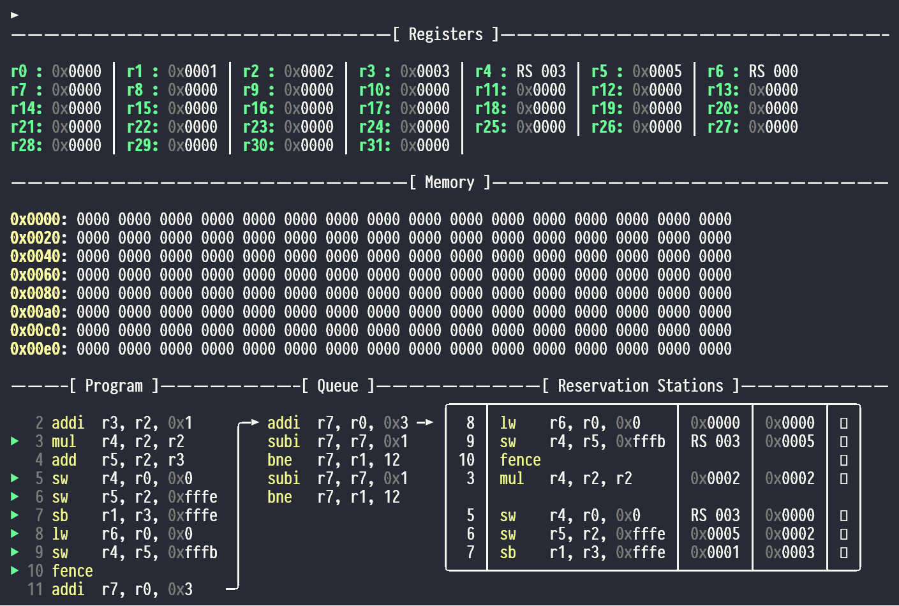

# Demonstration and Evaluation {#sec:evaluation}
\marginpar{Melina Hoffmann}

As specified in [chapter @sec:task], our goal is to implement a CPU emulator that offers out-of-order and speculative exection in order to demonstrate a Meltdown and a Spectre attack.
In this chapter we demonstrate that our emulator allows the user to execute both a Meltdown and a Spectre attack, with the use of basic example programs. 
Firstly, we introduce the general functionality and visualization of our emulator on a simple example program that does not yet implement microarchitectural attacks in [@sec:evaluation_example].
Then, we demonstrate both the Meltdown and the Spectre variant which are possible on our emulator in [@sec:evaluation_meltdown] and [@sec:evaluation_spectre] respectively.
Lastly, we show different mitigations against these microarchitectural attacks on our emulator, which are based on mitigations gainst real life microarchitectural attacks in [@sec:evaluation_mitigations].

## Example Program {#sec:evaluation_example}
\marginpar{Melina Hoffmann}

<!--
brief example program showing all the features in a "normal" execution, e.g. adding stuff
at least one instruction from each category
at least one faulting (memory) instruction
faulting branch
main goals: 
    shown what the vizualization looks like
        default view
        different components
        especially cache
        instructions in RS waiting for operands
        memory instructions execution vs. retiring
    show that the emulator works in general
why are the files called .tea again? transient emulator assembly?

einfach mal Programm aufschreiben und morgen ausführen und schauen, ob es so passt
    sieht man irgendwas nicht? wäre eine andere Reihenfolge schöner?
    
Bilder erstmal reinwerfen wie sie kommen, evtl. am Donnerstag oder heute Abend wenn noch Zeit ist Bilder klein nebeneinander stellen oder so

Demoprogramm ausführen und schauen ob es sich verhält wie erwartet
ggf. Demoprogramm anpassen
Plan machen, was genau man an jeder Stelle des Programms gezeigt bekommen soll
anschauen, was für ein Bild lenni für das UI gemacht hat und wie er es eingefügt hat
gleichzeitig Demoprogramm Schritt für Schritt ausführen und Text schreiben 
    ggf. mit Windowssnippigtool Bilder machen und später einfügen
auch nur das beschreiben und bebildern
nicht in Details verlieren!

{#fig:context width=470px height=317px shortcaption='Example output of the context screen'}
.png Bilder in den Ordner fig/ legen
-->

goals:
    shown what the vizualization looks like
        default view
        different components
        especially cache
        instructions in RS waiting for operands
        memory instructions execution vs. retiring
        introduction, not exhaustive manual
        complete list of commands of the UI, already descussed/ introduces in detail in [@sec:UI]
    show that the emulator works in general
show example code
program is run on the default config settings as discussed in [@sec:config] (compare my system to requirements from chapter 5?)

go through everything I want to show of the code with pictures
    maybe later look up how I can make the pictures small and group them
    set at least one breakpoint, at a point where I would want to have a pause anyway?
    also: show commands as part of pictures: not main focus, but maybe mention with which commands the output was generated, if it fits

## Meltdown Demonstration {#sec:evaluation_meltdown}

todo

            show example program

            maybe compare to example program for real life architecture from SCA or literature (Gruss) if available

            explain which Meltdown variant it implements

            briefly highlight which components (we expect to) interact to make it work

            how well does it work?

## Spectre Demonstration {#sec:evaluation_spectre}

todo

            same as Meltdown

## Mitigations Demonstration {#sec:evaluation_mitigations}

todo

            it is known which mitigations exist, here is what we have in our emulator:

            what is possible in our program as is
                planned:    cache flush: microcode -> config file
                            mfence im assembler (normally in compiler)
                            aslr directly in program -> config (es gibt ja auch mitigations, die keine echte mitigation sind; nice to have -> könnte demonstrieren dass es nicht der Fall ist; war eh schon einige Jahre vor Meltdown vorhanden/ in Gebrauch; KSLR brachen kann man auch als Angriff verkaufen)
                            flush IQ -> passiert eh schon, ist das überhaupt eine echte mitigation?
                            disable speculation (nice to have, lassen wir weg)-> config
                            out of order -> in config RS mit nur einem Slot
                            zero mem load result

            is our meltdown/ spectre variant still possible?
            ggf. how does this affect the performance?
            vorsichtig sein, dass man dann auch die richtige Frage für die Antwort stellt
                in real life (already in background)
                in our program

            what would be the necessary steps/ changes to the program for further mitigations
                compare to changes in hardware by the manufacturers
