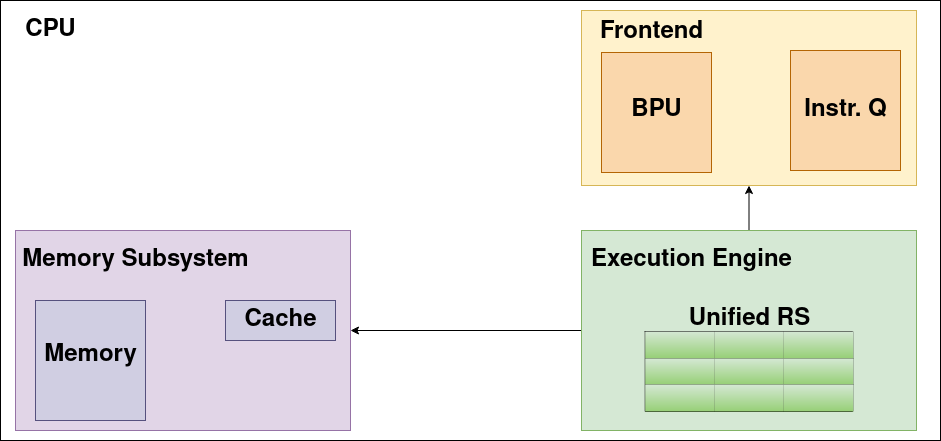
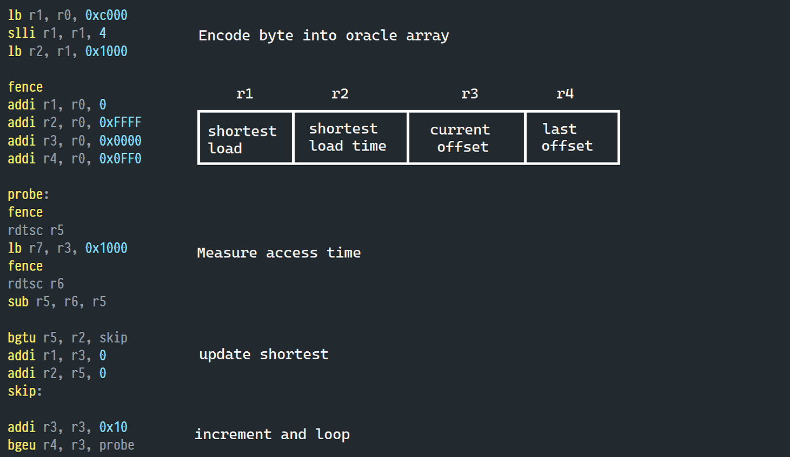

## Structure
- Topic

- Background

- Our task

- Our approach

- Implementation

- Demo

- Conclusion
<!--
Aufteilung:

- Einleitung (Felix)
- Backend (Melina)
- Demo: Meltdown (Lenni)
  - Mitigation: Return zero
- Demo: Spectre (Jan)
  - Mitigation: Flush cache
-->

## Topic

- Lab builds on SCA lecture

- Meltdown and Spectre mostly patched

- Difficult to experiment with
  - Personal computer often times not usable

- Goal: Vulnerable CPU Emulator that runs on many systems
  - Should offer a gdb-like interface

# Background

## CPU

- Frontend:
  - Fetches/Decodes instructions, maintains queue
  - Branch prediction

- Execution Engine:
  - Multiple sets of execution units

- Memory Subsystem:
  - Handles memory operations
  - Maintains L1 cache
  - Ensures data is loaded from other caches/memory

## Out-of-order execution

- Independent instruction streams

- Tomasulo algorithm:
  - Reservation stations

  - Common Data Bus
  
- Rollbacks

## Speculative execution

- Predict results of branch instructions

- Prevent stalls

- BPU maintains counters

- Rollbacks

## Meltdown

- Abuses out-of-order execution

- Meltdown-US-L1:
  - Define oracle array
  - Perform illegal read to steal secret
  - Embded secret-dependent oracle entry into cache
  - Await rollback and measure oracle access times
  
- Small time window

## Spectre

- Abuses speculative execution

- Different variations. Here: prediction of branch instrs.

- Spectre v1: Deliberately train BPU used by victim process

- Make victim leak secret into cache

- Direct consequence of speculative execution

## Mitigations: Meltdown

- Disable out-of-order execution

- Intel's microcode mitigation
  - Microprograms

- OS mitigations

## Mitigations: Spectre

- Disable speculative execution:
  - Completely disable
  - fence instructions
  
- Flush entire cache after rollback

## Our task

- Develop graphical CPU emulator vulnerable to:
  - Our version of Meltdown-US-L1
  - Spectre v1

- Must support single step, out-of-order, and speculative execution

- Implement Intel's microcode mitigation

- Other mitigations via microprograms

- Target audience: SCA students
  - Or anyone with basic knowledge of TE attacks

# Our approach

## How we started

- Must-haves, nice-to-haves, future work

- At time of Meltdown/Spectre publication: Skylake

- Filter components needed for our Meltdown/Spectre versions

- Build simplified CPU

## Our version
{ style="margin: auto;" }

<!-- Übergang zu Melina-->

# Implementation of our emulator

- overview over our whole emulator

- out-of-order execution

- speculative execution

- fault handling and rollbacks

## CPU class

{ style="margin: auto;" }

## Parser

- assembler style source code

- arithmetic, branch and memory instructions, fence, rtdsc

- provides an instruction list 

- only one type of instructions

## CPU components

{ style="margin: auto;" }

## Out-of-order execution

- Execution Engine

- Tomasulos algorithm

    - unified reservation station
    
    - instructions wait for their operands
    
    - keeping track of operands and results
    
## Issuing instructions  

- resolve operands and target register 

- two kinds of register values: Word and SlotID

- put register content into operand list

- put SlotID into target register

## Example Reservation Station

{ style="margin: auto;" }

## Common Data Bus (CDB)

- execute instructions in reservation station

- broadcast the result over the CDB
    
    - registers
    
    - reservation station slots
    
    - at most once per cycle
    
## Speculative execution

- predict outcome of branch instructions

- resume execution based on this prediction

- two central components 

    - branch prediction unit (BPU)
    
    - CPU frontend with instruction queue
    
## Branch Prediction Unit (BPU)

- simplified version

- array of predictions

- 2-bit-saturating counter to handle predictions

## CPU frontend with instruction queue

- interface btw. instruction list and execution unit 

- especially wrt speculative execution

- manages instruction queue
 
{ style="margin: auto;" }

## Faults and Rollbacks

- microarchitectural fault situation that has to be handled bevore we can resume our execution

    - mispredicted branches
    
    - attempt to access inaccessible memory
    
- have to handle the effects of transient execution

## Rollback

- only rollback the register state and the memory contents

- no rollback in Cache and BPU

- restore register state via snapshots

- prevent memory rollbacks by executing stores in-order

- handle faults in program order

## Rollback after mispredicted branch

{ style="margin: auto;" }

## Thank you for your attention

Do you have any questions so far?
    
## References

# Demo

## Demo - Meltdown

{ style="margin: auto;" }

- ja

